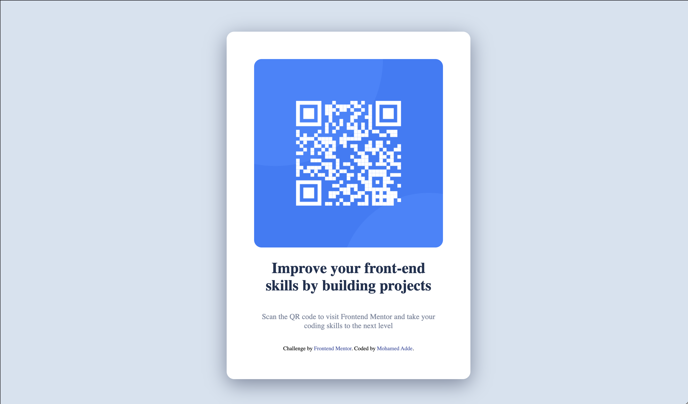

# Frontend Mentor - QR code component solution

This is a solution to the [QR code component challenge on Frontend Mentor](https://www.frontendmentor.io/challenges/qr-code-component-iux_sIO_H). Frontend Mentor challenges help you improve your coding skills by building realistic projects. 

## Table of contents

- [Overview](#overview)
  - [Screenshot](#screenshot)
  - [Links](#links)
- [My process](#my-process)
  - [Built with](#built-with)
- [Author](#author)

## Overview

### Screenshot

### Links

- Solution URL: https://github.com/mohaomar495/FrontendMentorProjects/tree/main/qr-code-component-main
- Live Site URL: https://qr-code-component-frontendmentors.netlify.app/

## My process

### Built with

- Semantic HTML5 markup
- CSS custom properties

## Author

- Github - [Mohamed Adde](https://github.com/mohaomar495)
- Frontend Mentor - [@mohaomar495](https://www.frontendmentor.io/profile/yourusername)
- Twitter - [@yMohammadAdde](https://www.twitter.com/yourusername)
